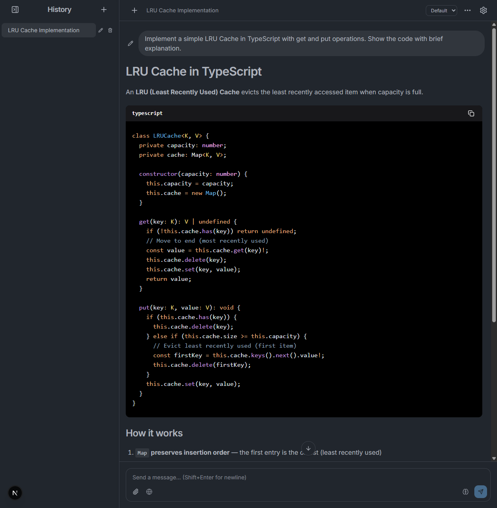

# LunaChat

一个浏览器原生的 AI 聊天应用，支持 ReAct 工具循环、消息分支和多 Provider。所有数据存储在浏览器本地，无需服务端数据库。



## 功能特性

- **多 Provider 支持** — OpenAI、Anthropic、OpenAI Responses API，以及任何兼容端点
- **浏览器本地存储** — 消息和设置存储在 IndexedDB，数据不会离开你的设备
- **消息分支** — 编辑消息创建分支，在不同回复间切换
- **内置工具** — Web 搜索、代码解释器、图片生成、文件搜索（取决于 Provider）
- **推理强度控制** — 7 级选择器调节模型思考深度
- **ReAct 工具循环** — 自动多步工具调用，支持流式输出
- **配置 Profile** — 多个 Provider 配置，一键切换
- **API Key 加密** — 可选的口令加密保护存储的凭据
- **服务端代理 + 访问门控** — 可选 `API_ACCESS_TOKEN` 保护部署实例
- **暗色模式** — One Dark Pro 风格主题，支持跟随系统

## 快速开始

```bash
git clone https://github.com/mengshouer/LunaChat.git
cd lunachat
npm install
npm run dev
```

打开 <http://localhost:3000>，点击 **Open Settings**，配置 Provider（Base URL + Model）即可使用。

## 部署

### Vercel

[](https://vercel.com/new/clone?repository-url=https://github.com/mengshouer/LunaChat&env=API_ACCESS_TOKEN&envDescription=Optional%20access%20token%20to%20protect%20API%20proxy%20routes)

### Netlify

[](https://app.netlify.com/start/deploy?repository=https://github.com/mengshouer/LunaChat)

## 环境变量

| 变量               | 必填 | 说明                                                             |
| ------------------ | ---- | ---------------------------------------------------------------- |
| `API_ACCESS_TOKEN` | 否   | 设置后，所有 `/api/*` 请求必须携带匹配的 `x-access-token` 请求头 |

## 技术栈

- [Next.js 15](https://nextjs.org/) (App Router)
- [React 19](https://react.dev/)
- [TypeScript](https://www.typescriptlang.org/)
- [Tailwind CSS 4](https://tailwindcss.com/) + [Radix UI](https://www.radix-ui.com/)
- [Dexie](https://dexie.org/) (IndexedDB)
- [nuqs](https://nuqs.47ng.com/) (URL 状态管理)
- [Vitest](https://vitest.dev/) (测试)

## 工作原理

```
浏览器 ←→ Next.js API 路由（薄代理）←→ LLM Provider API
        ↕
  IndexedDB（消息、线程、配置）
```

- **Client 模式**：浏览器直接调用 LLM API（需要 CORS 支持）
- **Server 模式**：请求通过 `/api/llm` 代理转发（绕过 CORS，对网络层隐藏 Key）
- **Auto 模式**（默认）：优先尝试 Client，失败后自动回退到 Server

## 许可证

[MIT](LICENSE)
